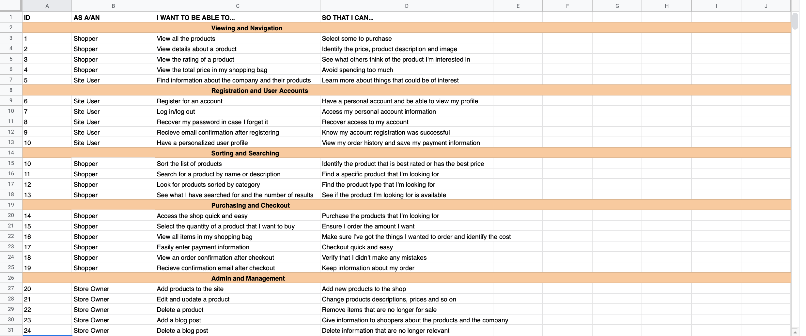

# Of Stories Webshop  

[A live version of the page can be viewed here](https://of-stories.herokuapp.com/)  

This is a webshop for my own brand Of Stories that sells collections of handmade goods for your home. The sites purpose is t

---  

## UX  

### The Goals For This Website Is To:  

- Give users the possibility to find unique collections of handmade items for their home
- Support small businesses 
- Share stories about the company and their products through the blog

- Make it easy for users to navigate the site on any device   
- Be able to create an account for a smooth and easy shopping experience

### User Stories  

### Design   
I wanted the site to be easy navigated with a clean and minimalistic design. The focus should be on the images of the products.

 #### Colors  
Beyond white for the navbar and footer and a darker grey #555 for the body text I wanted to have a main color that was calming for the eye and that was representing nature and sustainability. I choose two different shades of green that I thought fit this purpose perfectly, #637867 & #939891. #F2F1EF was picked from the hero image on the index page and used as an  background overlay to tie the pages together. 

 #### Typography
 The font used for this website is Open Sans from [Google Fonts](https://fonts.google.com/specimen/Open+Sans?query=open+sans)
 

### Wireframes  

Wireframes can be viewed [here](static/README/wireframes/MS4-wireframes.pdf)  

---

## Features
### Existing Features

- **Navbar**   
    Each page features a responsive Bootstrap navbar that’s collapsed to a burger icon when viewing on smaller screens. The navbar has a hover effect so when the user hovers over the different pages the text changes color. In the left corner there is a logo with a link that takes you to the landing page. To the right is a search field where users can search for products on the site and a shortcut to the shopping bag with the amount displayed underneath. 
    - Users that are not logged in have the following pages in the navbar:
        - SHOP 
            - BLANKETS
            - BASKETS
            - PILLOWS
            - ALL PRODUCTS
        - BLOG
        - SIGN UP
        - LOG IN
        - CONTACT  
    - Users that are logged in have the following pages in the navbar:
        - SHOP
            - BLANKETS
            - BASKETS
            - PILLOWS
            - ALL PRODUCTS
        - BLOG
        - MY PROFILE
        - LOG OUT  
    - Superuser that are logged in have the following pages in the navbar:
        - HOME
        - SHOP
            - BLANKETS
            - BASKETS
            - PILLOWS
            - ALL PRODUCTS
        - BLOG
        - ADMIN 
            - ADD PRODUCTS 
            - ADD BLOGPOST
        - MY PROFILE
        - LOG OUT  

- **Footer**  
    The footer is displayed on all pages and features links to the companys social media accounts.

- **Home**  
    The landing page features a background image with a call to action button with the text *shop now* that leads to the product page so that users have an easy and quick way of finding the products.

- **Sign Up**
    This page contains a sign up form to register an account.

- **Log In**
    This page contains a form for the user to login to their account.

- **Password reset page**
    Option for users to reset their password by email.

- **Shop**
    The user can choose to navigate to all products or to view the products by category. The products page features images of the products followed by name, price, category and rating. The user have the possibility to sort products by price, rating, name and category in either descending or ascending order.

- **Product page**
    The detailed page of the product features an image of the product that enhances in a new window when you click on it. The user also finds the name, price, category, rating and information about the product, along with an input for choosing the amount of products to add to the bag. Clicking on Add to bag button will trigger a sucess message with feedback of the action. For the superuser there is also an edit and a delete link that takes the superuser to an edit form for that product, or to a confirmation page for deleting the product. There's also a breadcrumb for easy navigation back to the products.

- **Add a product**
    This page is only available for the superuser. It contains a form to add new products to the database. 

- **Edit product**
    This page is only available for the superuser. It contains a form to edit Category, Sku, Name, Description, Price, Rating and Image. The form is prefilled with the information earlier provided.The 'update product' button then add the products new information to the database. The 'cancel' button leads back to the all products page.

- **Delete product**
    This page is only available for the superuser and is triggered when the Delete button on the product page is clicked. It contains a confirmation text with the name of the actual product being deleted along with two buttons, one that cancels the action and one that deletes the product from the database.

- **Blog**
    The blog page shows a list of the blog posts with the most recently being added at the top. Every post has a "Read more" button that is linked to the posts detailed page. The user can also click on the header to be redirected to the same page. For the superuser there is also an edit and a delete link that takes the superuser to an edit form for that blog post, or to a confirmation page for deleting the post.

- **Blog post**
    This page contains the entire blog post text and a link that leads back to all blog posts. For the superuser there is also an edit and a delete link that takes the superuser to an edit form for that blog post, or to a confirmation page for deleting the post.

- **Add blog post**
    This page is only available for the superuser. It contains a form to add new blog posts to the database. 

- **Edit blog post**
    This page is only available for the superuser. It contains a form to edit Title, Slug, Author, Content and Status. The form is prefilled with the information earlier provided. The 'update post' button then add the blog posts new information to the database. The 'cancel' button leads back to the blog page.

- **Delete blog post**
    This page is only available for the superuser and is triggered when the Delete button on the blog post is clicked. It contains a confirmation text with the name of the actual post being deleted along with two buttons, one that cancels the action and one that deletes the post from the database.

- **My Profile**
    This page features the users default delivery information and with the possibility to update them if needed. There's also the users order history to keep track of previous orders.

- **Contact**
    This page features a contact form for the user to easily get in touch with the store.

- **Shopping Bag**
    Gives a detailed information about what's in the users shopping bag, it displays the Product info, Prize, Quantity and subtotal. The user can change the quantity of the products or remove them. The user can see the bags total amount, any delivery costs and how much more they need to spend to get free delivery. There is also a 'keep shopping' buttons that redirects back to the products or a checkout button that leads to the checkout page.

- **Checkout**
    This page contains a summary of the users order along with a form where the user fills in their delivery and payment information. If the user is logged in and have saved this information in their profile the form is prefilled with this information. There is a "Adjust bag" button that leads back to the shopping bag and an "Complete order" button for paying and confirming the order.

### Features Left To Implement  

    - Pagination would be a good feauture to have when adding more products to the site
    - To be able to add images to blog posts to make them more vivid and intresting
    - Upload a wider range of pictures for each item
    - A newsletter so that users could sign up and get the latest updates and offers 

## Database   

Diagram of my database:

  

---  

## Technologies Used  

### Languages  

- HTML5, CSS3, Javascript, Python and with Python framework Django

### Frameworks and Libraries  

- [Bootstrap](https://getbootstrap.com/) 
- [FontAwesome](https://fontawesome.com) 
- [Google Fonts](https://fonts.google.com) 

### All other tools  

- [Heroku PostgresSQL](https://www.postgresql.org/) - used for relational database storage
- [Heroku](https://dashboard.heroku.com/) - used to deploy the live site
- [GitPod](https://www.gitpod.io) - used for their IDE while building the website
- [GitHub](https://github.com) - used to store repository
- [Balsamiq](https://balsamiq.com) - used to create wireframes
- [DevTools](https://developers.google.com/web/tools/chrome-devtools) - used to test responsiveness 
- [Lighthouse](https://developers.google.com/web/tools/lighthouse) - used to improve performance
- [Tinypng](https://tinypng.com) - used to compress images
- [Freeformatter](https://www.freeformatter.com/) - used to beautify code
- [Coolors](https://coolors.co) - used to create color palette
- [dbdiagarm](https://dbdiagram.io/home) - used to create database diagram 
- [Am I Responsive](http://ami.responsivedesign.is/#) - used to create the mockup image in the beginning of this README file.
- [AWS S3 Bucket](https://aws.amazon.com/) - was used for storing static and media files
- [W3C Markup Validation Service](https://validator.w3.org) - used to validating the HTML code
- [W3C CSS Markup Validation Service](https://jigsaw.w3.org/css-validator/) - used to validating the CSS code
- [JSHint](https://jshint.com) - used to validating javascript code
- [PEP8 online](http://pep8online.com) - used to validating python code

---

## Testing  

Testing information can be found [here](TESTING.md)  

---

## Deployment  

### Create Project  

This project was created on Github using the following steps: 
1. Navigate to [GitHub](https://github.com/) and sign in
2. On the left hand side above the list of your repositories click on the green button that says "New", this will create a new repository
3. From the drop down menu that says "Repository templates" I choose the Code Institute Template  
4. Enter a name for the project and then click on the green button that says "Create Repository"

Before creating the Heroku app you need to add the following files in Gitpod:

 - To create your requirements file, type this in the terminal:
    - pip3 freeze > requirements.txt
 - Install Gunicorn
 - Create a Procfile and make sure it contains the following line: web: gunicorn [YOUR APP NAME].wsg:application (and that it is no blank line after it).

### Deployment to Heroku  

This project was deployed through Heroku using the following steps:
1. Navigate to [Heroku](https://dashboard.heroku.com/login) and sign in
2. On the top right corner there is a button that says "New". Click this button and choose the option "Create New App"
3. Choose a name for the App and what region that are closest to your location, click "Create App"
4. Click on the tab saying "Deploy" and select GitHub, Connect to GitHub
5. Enter the name of your repository on GitHub and click search
6. When the repository is found, click the "Connect" button
7. Click on the tab saying "Resources" and go to "Add-ons"
8. Search for Heroku Postgres and choose it in the appearing list
9. Select the plan named "Hobby Dev - Free" and click Submit order form
7. Click on the tab saying "Settings" and then click on the button saying "Reveal config vars"

8. Add these variables:

    - AWS_ACCESS_KEY_ID  
    - AWS_SECRET_ACCESS_KEY 
    - DATABASE_URL 
    - EMAIL_HOST_PASS 
    - EMAIL_HOST_USER 
    - SECRET_KEY 
    - STRIPE_PUBLIC_KEY 
    - STRIPE_SECRET_KEY 
    - STRIPE_WH_SECRET 
    - USE_AWS 

The value of these keys depends on the users personal setup and will not be added here due to security reasons

9. Click on the "Deploy" tab and scroll down to the section "Automatic Deployment"
10. Choose the branch you want to deploy from and then click "Enable Automatic Deploys"

### How To Run The Code Locally  

1. Log in to Github.
2. Navigate to the [repository](https://github.com/flisanp/ms4-of-stories-shop)
3. Click the tab that says "Code" and from the dropdown menu choose copy Git URL
4. Open Git and type "git clone" in the terminal followed by the URL you just copied, press enter to create your local clone
5. To install the packages listed in the requirements file type the following in the terminal: 
pip3 install -r requirements.txt

### Fork Project  

To fork the project follow these steps:

1. Log in to Github
2. Navigate to the [repository](https://github.com/flisanp/ms4-of-stories-shop)
3. Locate the "Fork" button on the top right corner of the page
4. A duplicate of the original repository is now in your Github account

---

## Credits

### Code

https://djangocentral.com/building-a-blog-application-with-django/

### Content  
 

### Media

  

---

## Acknowledgements

